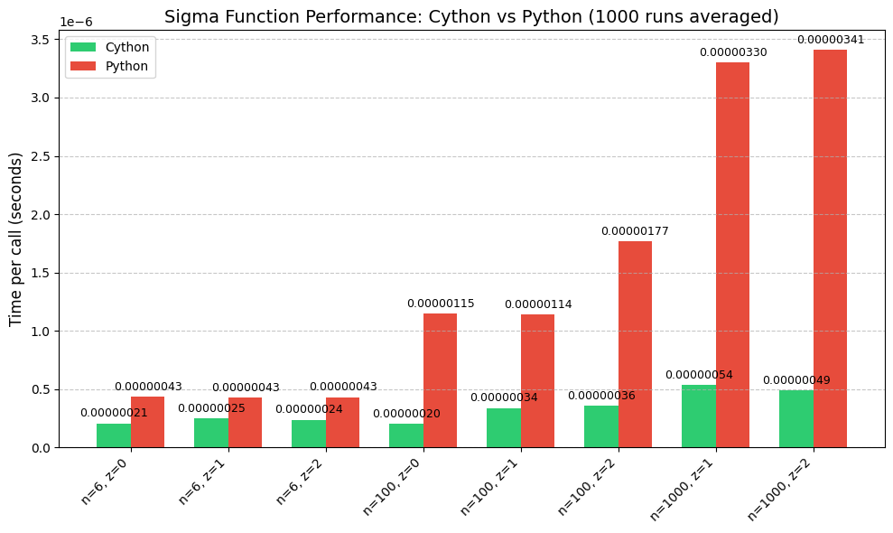

[](https://discord.gg/xkvjwsDrnx)

Python package for perform curated arithmetic calculation with __Cython__. this project was inspired with math (theory) and implementing on python library. this package using cython for speed up calculation and more optiomal and faster code.

## Install package

Currently `mega` not available or registered on official pip , you can directly install mega with `pip install git+` parameter

```bash
pip install git+https://github.com/WargaSlowy/mega
# adding --break-sytem-packages if you want to install globally
```

## Build Package

> [!NOTE]  
> Make sure to install `uv` for build this package.
> Information you can check [here](https://docs.astral.sh/uv/getting-started/installation/) for initialization

```sh
git clone https://github.com/mega
cd mega
```

build package
```sh
uv run setup.py build_ext --inplace;
uv pip install -e .
```

## Usage

```python
import mega.op.function as function

number: float = 5.2
gamma_function = mega.GammaZ(number)
print(gamma_function.compute())
```

## benchmark information

**Sigma Function**

